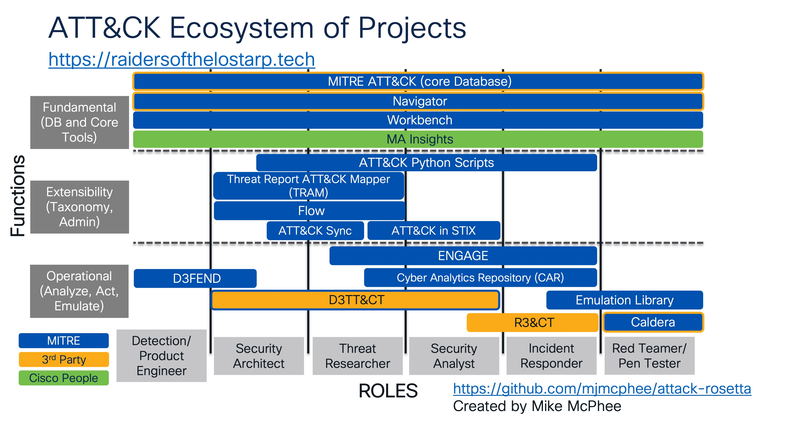

# attack-rosetta
## Introduction
A Rosetta Stone for MITRE ATT&amp;CK related projects, offering links and role-based guidance. This will be added to as time permits, and while it does not catacoogue every single ATT&CK-related project, it does seek to cover those most directly tied to the project and to this author's work.

## Core Framework & Database:
- [MITRE ATT&CK](https://attack.mitre.org): This core project website offers browsable access to the ATT&CK Database, links to Navigator views, and pivots to the source information that drive its open-source contents. This is a must across all roles.

## Core Tools:
- [ATT&CK Navigator (Online version)](https://mitre-attack.github.io/attack-navigator/): This lightweight web application acts as a workspace upon which to map coverage against various versions and matrices of ATT&CK. This is heavily used across the defensive specialties, and can help with gap analysis of visibility and detections.
- [ATT&CK Navigator (for self-hosting)](https://github.com/mitre-attack/attack-navigator): Should a publicly hosted version not be desired, Navigator can also be run in a private instance based on Node.js. Docker and native Node.js versions are located here.
- [ATT&CK Workbench](https://mitre-engenuity.org/cybersecurity/center-for-threat-informed-defense/our-work/attck-workbench/): ATT&CK Workbench offers a browser plug-in that enables users to annotate, enrich, and better leverage the ATT&CK DB as part of their own workflows.

## Extensibility, taxonomy, and integration:
- [ATT&CK Python Scripts](https://github.com/mitre-attack/mitreattack-python): MITRE's CTID has provided these scripts to help in accessing ATT&CK's contents from within SOC tools or other projects.
- [Threat Report ATT&CK Mapper](https://mitre-engenuity.org/cybersecurity/center-for-threat-informed-defense/our-work/threat-report-attck-mapper-tram/): This tool leverages Machine Learning and an AI LLM to assist CTI researchers in accurately mapping threat intelligence to ATT&CK TTPs.
- [ATT&CK Flow](https://center-for-threat-informed-defense.github.io/attack-flow/): ATT&CK is very focused on the atomic actions taken by adversaries, but Flow is a method by which to tie those atomic elements together into patterns of behavior. This is useful in crafting emulation plans, assigning attribution, and understanding Attack Chains.
- [ATT&CK Sync](https://center-for-threat-informed-defense.github.io/attack-sync/): MITRE ATT&Ck is under continual renewal, and Sync offers assistance in migrating artifacts from older to newer versions.
- [ATT&CK in STIX](https://github.com/mitre/cti): Many SOC tools (SIEMs, TIPs, etc.) receive threat intelligence updates via feeds. This project helps map ATT&CK TTPs to appropriate STIF formats (currently 2.0). 

## Operational Tools:
- [MITRE D3FEND](https://d3fend.mitre.org/): MITRE D3FEND is a tool that was created to assist in mapping intellectual property (patents) to ATT&CK's potential detections (or data sources in current versions). This can be useful for detection engineers and product developers who are seeking to leverage their solutions to offer more detection value.
- [MITRE ENGAGE](https://engage.mitre.org/): MITRE ENGAGE is a project that helps use ATT&CK to recommend response actions, active defense strategies and more that flip the script on adversaries.
- [Cyber Analytics Repository (CAR)](https://car.mitre.org/): CAR is a fantastic repository of publicly shared analytics that can help SOC's quickly add detections of TTPs to their SIEM/XDR. Psuedocode, EQL, and other scripts are provided as available to accelerate time to value.
- [ATT&CK Emulation Library](https://github.com/center-for-threat-informed-defense/adversary_emulation_library): For folks who need to understand how the adversaries' playbooks are implemented, this library is a great first step. It leads readers through how an operation is conducted and provides ample material for emulating or understanding the threat actors.
- [MITRE Caldera](https://caldera.mitre.org/): Breach Attack & Simulation tools can offer a means by which to validate that detections are working properly and mitigations are having intended impact. Caldera is MITRE's offering that allows Red and Blue Team operations around simulated attacks.

## 3rd Party Tools and extensions of note:
- [Atomic Red Team (ART)](https://github.com/redcanaryco/atomic-red-team): Red Canary generated this phenomenal and comprehensive list of tests to be used to validate that detection analytics you *think* are in place actually trigger. This library of tests is leveraged heavily in Breach & Attack Simulation tools, scripts and the like by almost anyone in the business.
- [Atomic Threat Coverage (ATC)](https://github.com/atc-project/atomic-threat-coverage): This community-developed tool helps generate detection analytics based on available  data sources and mapping them to ATT&CK's TTPs. It leverages Red Canary's ART for detection triggers. The chief output is Sigma rules, but it also offers mitigation mapping through a sub-project [ATC-Mitigation](https://github.com/atc-project/atc-mitigation), TheHive templates, Navigator json profiles, and Elastic/Kibana dashboards and analytics.
- [D3TT&CT](https://github.com/rabobank-cdc/DeTTECT): This project is essential to helping map coverage based on Operating System and kernel features, configurations, and the corresponding logging options. Running as either a local Python web service or available as a container, this tool helps in creating mappings of detections and coverages, as well as in defining new adversaries TTP maps. 
- [REACT](https://atc-project.github.io/atc-react/): this project's collaborators set out to map actionable Incident Response actions to ATT&CK TTPs, and can be useful to IR folks in ensuring they have their bases covered.
- [MITRE ATT&CK Insights](https://ma-insights.vercel.app/overview): This project seeks to help users visualize how prevalent TTPs are for each attacker, and alternatively how popular TTPs, software, malware and the like are across all ATT&CK-categorized threat actors.
